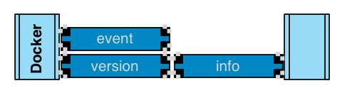
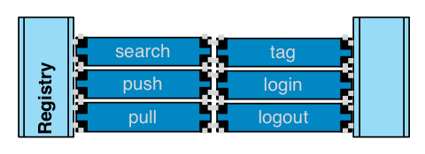
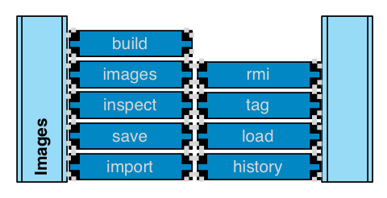
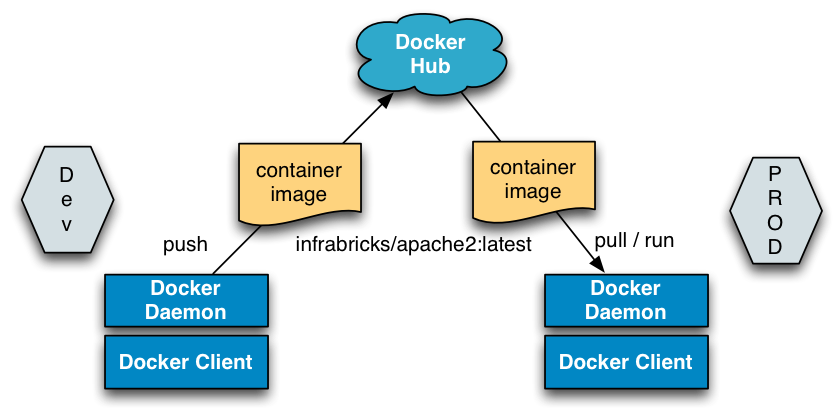

# Docker Basics Workshop

**Walk-through Docker**

  - Andreas Schmidt @aschmidt75
  - Peter Rossbach @PRossbach
---
## Was ist Docker?

Die Werbung verspricht:

  * Container Virtualization
  * Build, Ship and Run Any App, Anywhere
  * Build once, run in many places
  * Isolated and content agnostic

---
## Docker Command Flow


---
## Docker-Daemon



-
**`~$ docker version`
**
#### Bestimmung der Version

Bestimme der eigene Docker-Client und Docker Server-Version
***
```bash
$ docker version
Client version: 1.3.0
Client API version: 1.15
Go version (client): go1.3.3
Git commit (client): c78088f
OS/Arch (client): linux/amd64
Server version: 1.3.0
Server API version: 1.15
Go version (server): go1.3.3
Git commit (server): c78088f
```
***
  * Mit Docker 1.3 kommuniziert der Client mit dem Server Remote via SSL damit *Trusted* Images überprüft werden können (boot2docker 1.3)
  * Client und Server müssen passen!?
---
## Docker-Registry



-
**`~$ docker search`**
####
 Auf der Suche nach dem goldenen Image

***
```bash
$ docker search centos
NAME                         DESCRIPTION                                     STARS     OFFICIAL
centos                       The official build of CentOS.                   442       [OK]
tianon/centos                CentOS 5 and 6, created using rinse instea...   28
saltstack/centos-6-minimal                                                   6
blalor/centos                Bare-bones base CentOS 6.5 image                6

$ docker search -s 100 centos
NAME      DESCRIPTION                     STARS     OFFICIAL   AUTOMATED
centos    The official build of CentOS.   442       [OK]
```
***
  * Suche ist etwas mühsam und unübersichtlich
  * *Stars* sind eine ungenaue Bewertungsangabe, Suche nach *Official* bzw. *Trusted“* Images nicht möglich.
  * Versionen (z.B. hier von CentOS) werden nicht angezeigt, nur das Repository
  * Besser zum Suchen: [Docker Hub](https://registry.hub.docker.com/search)

-
**`~$ docker pull`**
####
 Wir brauchen das Image lokal um es zu verwenden

  * Download eines Repositories (oder Teilen davon) von der öffentlichen Docker-Registry.
***
```bash
$ docker pull centos:latest
Pulling repository centos
70214e5d0a90: Download complete
511136ea3c5a: Download complete
34e94e67e63a: Download complete

$ docker pull redis:latest
```
***
  * **Wichtig:** Tag mit angeben! Sonst wird das gesamte Repository gezogen
(z.B. Ubuntu 12.04/12.10/13.04/13.10/14.04  >> 1GB)

-
**`~$ docker images | inspect`**
####
Die lokalen Images ansehen

Ansehen der lokal gespeicherten Images, inkl. Details
***
```bash
$ docker images
REPOSITORY          TAG                 IMAGE ID            CREATED             VIRTUAL SIZE
centos              latest              70214e5d0a90        2 weeks ago         224 MB
$ docker images –a
$ docker inspect 70214e5d0a90
[{
    "Architecture": "amd64",
    "Author": "The CentOS Project \u003ccloud-ops@centos.org\u003e - ami_creator",
    "Comment": "",
...
```
-
**`~$ docker rmi`**
####
 Ein lokales Image entfernen

Einzelne Images aus dem lokalen Cache löschen
***
```bash
$ docker images
REPOSITORY          TAG                 IMAGE ID            CREATED             VIRTUAL SIZE
centos              latest              70214e5d0a90        2 weeks ago         224 MB

$ docker rmi 70214e5d0a90
```
***
  * Solange es noch Container (laufend oder nicht laufend) gibt, zu denen das gewünschte Image ein *Parent* ist, müssen diese erst entfernt werden.
  * D.h. das Image lebt erstmal weiter, auch wenn der Container schon weg ist.
  * --force hilft im Notfall.

-
**`~$ docker history`**
#### Zeig die Befehlshistorie des Images an
```bash
vagrant@serverspecbox:~$ docker history 1934124c12e6
IMAGE               CREATED             CREATED BY                                      SIZE
1934124c12e6        35 hours ago        /bin/sh -c #(nop) CMD [/opt/tomcat/bin/catali   0 B
9684515b6ed4        35 hours ago        /bin/sh -c #(nop) USER [tomcat]                 0 B
e67fbffd0bc1        35 hours ago        /bin/sh -c #(nop) VOLUME [/opt/tomcat/webapps   0 B
873dac3a42c5        35 hours ago        /bin/sh -c #(nop) EXPOSE map[8009/tcp:{}]       0 B
28ff49ab11e7        35 hours ago        /bin/sh -c #(nop) EXPOSE map[8080/tcp:{}]       0 B
b4a64d089284        35 hours ago        /bin/sh -c #(nop) WORKDIR /opt/tomcat           0 B
9c1a2b07baf4        35 hours ago        /bin/sh -c apt-get clean autoclean &&     apt   0 B
c2a5714574ba        35 hours ago        /bin/sh -c groupadd -r tomcat -g 4242 &&   us   9.163 MB
...
```
---
### Docker-Images



-
**`~$ docker run`**
####
 Das wichtigste Kommando: Container starten!

Instanziieren eines einzelnen Containers
Vermutlich das Kommando mit den meisten Parametern.
***
```bash
~$ docker run -ti ubuntu /bin/bash
root@898c6047b8ab:/# hostname
898c6047b8ab

...

CTRL+P CTRL+Q zum detachen der shell
```
***
  * Im Image ist optional ein Kommando integriert.
  * Im Fall der Bash hier: Ein `exit` oder `CTRL-D` beendet die Shell, d.h. den Prozess, d.h. den Container.
  * So ist der Container aber noch laufigfähig vorhanden!
-
### Was bedeutet ein `docker start`?

  * Müssen wir hier nicht erklären, was wirklich passiert ist?
  * Container start bedeutet ja einiges:
    - Write layer über das Images
    - Bereitstellen des Netzwerks
    - Schaffen eines Namespace
    - Einschränkungen auf der Prozess vornehmen (CGroups, Capabillities)
    - Optional
      - Links vermitteln
      - Volumen mounten
      - Ports Freigeben
    - Prozess starten mit einem bestimmten Nutzer
-
**`~$ docker ps`**
####
 Container anzeigen

Übersicht über laufende und gelaufene Container

***
```bash
~$ docker ps
CONTAINER ID        IMAGE                         COMMAND             CREATED             STATUS              PORTS               NAMES
e6aa98c81a41        127.0.0.1:5000/ubuntu:14.04   /bin/bash           6 seconds ago       Up 5 seconds                            ecstatic_fermat


~$ docker ps -q
e6aa98c81a41

~$ docker ps –a | less
```
***
  * Der Status ist leider schlecht grep-bar.
  * Es existieren verschiedene Filtermöglichkeiten (`docker ps --help`)

-
**`~$ docker ps | attach`**

#### Sich mit interaktiven Containern verbinden

-
**`~$ docker rm
`**
#### Alte Container abräumen

Container, deren Prozess beendet wurde bleiben in der Containerliste stehen (`docker ps –a`). Der `rm`-Befehl löscht diese.
***
```bash
~$ docker ps –a
…

~$ docker rm e6aa98c81a41
e6aa98c81a41
```
***
  * Funktioniert nur mit abgelaufenen Containern (außer dann mit --force)
  * Besser: Beim run direkt --rm mitgeben

-
**`~$ docker logs`**
####
 Ausgabe von Container anschauen

***
```bash
$ docker logs e6aa98c81a41
root@e6aa98c81a41:/#
root@e6aa98c81a41:/#
root@e6aa98c81a41:/# exit
exit
```
***
  * `-f == follow`
  * `-t == timestamps`
  * `-tail == nur die letzten x Zeilen anzeigen`

-
**`~$ docker events`**

#### Ereignisse des Docker Daemons ansehen

Der Docker Daemon zeigt Ereignisse aus der API bzw. der Kommandozeile an.
***
```bash
$ docker events
…
```
***
  * Keine Besonderheiten. Nett zum Kennenlernen/Debuggen.
  * Sehr wichtig für Discovery-Mechanismen (l8r)
-
**`~$ docker diff
`**
#### Unterschiede im Filesystem anzeigen

Zeige Änderungen an, die der laufende Container im FS-Layer erzeugt
***
```bash
$ docker run -ti ubuntu

root@4a2ae02aed95:/# touch /tmp/x
root@4a2ae02aed95:/# rm /etc/sysctl.conf

CTRL+P CTRL-Q

$ docker diff 4a2a
C /tmp
A /tmp/x
C /etc
D /etc/sysctl.conf
```
***
  * Keine Besonderheiten. Interessantes Debugging-Werkzeug.
-
**`~$ docker top`**
####
Prozessdetails eines Containers anzeigen

STDOUT/STDERR eines Containers ansehen.
***
```bash
~$ docker top d8b
UID                 PID                 PPID                C                   STIME               TTY                 TIME                CMD
root                4201                7159                0                   12:16               pts/3               00:00:00            /bin/bash

~$ ps -p 4201
  PID TTY          TIME CMD
 4201 pts/3    00:00:00 bash
~$ ps -p 7159
  PID TTY          TIME CMD
 7159 ?        00:03:01 docker
```
***
  * Nur rudimentäre Informationen (s. deep dive später)
---
## Ausflug
Wollen wir hier einen Ausflug in die Namespaces und Cgroups wagen?
Anzeige welche Rechte wirklich vergeben sind im /proc File System
---
## Ziel: Apache-Container manuell bauen


```bash
~$ CID=`docker run –tdi ubuntu`
4fa4778a965316f24c968e47bf19ec1d555ac131279dcadc623113b95dd3555b

~$ docker attach $CID

root@4fa4778a9653:/# apt-get update
0% [Connecting to archive.ubuntu.com]
…

root@4fa4778a9653:/# apt-get install apache2
…

root@4fa4778a9653:/# which apache2
/usr/sbin/apache2

root@4fa4778a9653:/# apache2 -D FOREGROUND
<fehlermeldung, ENVs fehlen>

CTRL+P, CTRL+Q
Wenn wir apachectl -D FOREGROUD nutzen klappt es!
```

-
**`~$ docker commit`**
####
Den Dateisystem-Stand festhalten

Ein „Commit“ erzeugt ein neues Image auf Basis eines bestehenden Containers
***
```bash
~$ docker commit -a "infrabricks" -m "Just committed" 4fa4778a9653
ffdb1d64ba4d94be13c561e05c4cb6eb05b4b7ca319e9bc649aedb8c23568058

~$ docker images
REPOSITORY               TAG                 IMAGE ID            CREATED             VIRTUAL SIZE
<none>                   <none>              ffdb1d64ba4d        39 seconds ago      239.2 MB
…
```
***
  * Man kann auch gleichzeitig das Image „taggen“
  * Pausieren des Containers ist möglich (z.B. für Datenbanken)
---
### Übung:

  * Ersten Container stoppen
  * Container mit neuem Image starten
  * Apache2 installation suchen

---
## Weiter gehts

-
**`~$ docker tag`**
####
 Namen für Images

  * Ein „tag“ gibt einem Image (anhand seiner ID) einen Namen
  * docker tag [OPTIONS] IMAGE [REGISTRYHOST/][USERNAME/]NAME[:TAG]

***
```bash
~$ docker tag ffdb1d64ba4d infrabricks/httpd

~$ docker images
REPOSITORY               TAG                 IMAGE ID            CREATED             VIRTUALSIZE
infrabricks/httpd     latest              ffdb1d64ba4d        7 minutes ago       239.2 MB

~$ docker tag ffdb1d64ba4d infrabricks/httpd:2.2
~$ docker images
REPOSITORY               TAG                 IMAGE ID            CREATED             VIRTUALSIZE
infrabricks/httpd     latest              ffdb1d64ba4d        8 minutes ago       239.2 MB
infrabricks/httpd     2.2                 ffdb1d64ba4d        8 minutes ago       239.2 MB
```
***
  * Solange man nur lokal arbeitet, wird minimal nur ein Name benötigt.
  * Das Image hat nun diesen Namen, nicht die Container!
  * Sobald man in (private) Registries hochladen möchte, wird ein Registry-Host im Namen notwendig
  * Tagen üben (Date Tag, Package Tag dpkg-query -l apache2)
---
### Ziel: Apache-Container starten


```bash
~$ docker run \
	-tdi \
	-p 127.0.0.1:8000:80
	-e APACHE_RUN_USER=www-data \
	-e APACHE_RUN_GROUP=www-data \
	-e APACHE_LOG_DIR=/var/log/apache2 \
	-e APACHE_LOCK_DIR=/var/run/lock \
	-e APACHE_PID_FILE=/var/log/apache2/apache.pid \
	infrabricks/httpd:2.2 \
	/usr/sbin/apache2 -D FOREGROUND
04cbe4ab97d71594b4b5383d07d8a499691be1dd5e027482edea48e7fe685084

vagrant@docker-workshop:~$ netstat -nltp | grep 8000
(No info could be read for "-p": geteuid()=1000 but you should be root.)
tcp        0      0 127.0.0.1:8000          0.0.0.0:*               LISTEN      -

vagrant@docker-workshop:~$ curl http://127.0.0.1:8000/
```
***
  `docker ps, docker top, docker inspect`

---
**`~$ docker stop | kill`**

#### Container stoppen

Sendet SIGTERM und/oder SIGKILL an einen Container-Prozess
***
```bash
~$ docker ps
CONTAINER ID        IMAGE                       COMMAND                CREATED             STATUS              PORTS                    NAMES
04cbe4ab97d7        infrabricks/httpd:2.2   /usr/sbin/apache2 -D   11 minutes ago      Up 11 minutes       127.0.0.1:8000->80/tcp   cocky_fermi

~$ docker stop 04cb
04cb

~$ docker ps
CONTAINER ID        IMAGE               COMMAND             CREATED             STATUS              PORTS               NAMES
```
***
Stop kann mit –t <timeout_secs> ein Timeout gegeben werden, danach wird automatisch ein kill ausgeführt.
-
**`~$ docker history`**
####
Wie wurde ein Image zusammengesetzt?

Zeigt Änderungen der FS-Layer über die Zeit an.
***
```bash
~$ docker history infrabricks/httpd
IMAGE               CREATED             CREATED BY                                      SIZE
ffdb1d64ba4d        About an hour ago   /bin/bash                                       34.76 MB
96864a7d2df3        4 days ago          /bin/sh -c #(nop) CMD [/bin/bash]               0 B
809ed259f845        4 days ago          /bin/sh -c apt-get update && apt-get dist-upg   11.68 MB
9387bcc9826e        4 days ago          /bin/sh -c sed -i 's/^#\s*\(deb.*universe\)$/   1.895 kB
897578f527ae        4 days ago          /bin/sh -c rm -rf /var/lib/apt/lists/*          0 B
c1f3bdbd8355        4 days ago          /bin/sh -c echo '#!/bin/sh' > /usr/sbin/polic   194.5 kB
bfb8b5a2ad34        4 days ago          /bin/sh -c #(nop) ADD file:a889e7d86acdbac15e   192.5 MB
511136ea3c5a        15 months ago                                                       0 B
```
***
Interessant ist die SIZE-Spalte, welche Aktion wie viel zum FS-Volumen beigetragen hat ( Squashing *)

-
**`~$ docker run | VOLUMES`**

#### Mounten von Verzeichnissen in Container

Instanziieren eines einzelnen Containers
Vermutlich das Kommando mit den meisten Parametern.
***
```bash
~$ mkdir test
~$ touch test/x

$ docker run -ti -v /home/vagrant/test:/y ubuntu

root@27e2c738b5df:/# ls -al /y
total 8
drwxrwxr-x  2 1000 1000 4096 Sep 22 13:15 .
drwxr-xr-x 22 root root 4096 Sep 22 13:24 ..
-rw-rw-r--  1 1000 1000    0 Sep 22 13:15 x
```
***
  * Wichtig: Ein „Mount“ (z.B. NFS) kann nicht direkt in einen Container gemountet werden (weil ein Mount nicht nochmal gemountet werden kann)
  * Stattdessen Verzeichnisse auf dem Mount erzeugen, diese in den Container übergeben.
  * Der Host-Pfad kann weggelassen werden. Dann verwaltet Docker diesen intern (*).

---
## Ziel: Bauanleitung für Apache-Container


```bash
~$ mkdir apache2-build
~$ cd apache2-build/
~/apache2-build$ mkdir html
~/apache2-build$ echo '<html><body>Docker world</body></html>' > html/index.html

$ cat Dockerfile
FROM ubuntu:14.04

RUN apt-get update -yqq
RUN apt-get install -yqq apache2

ENV APACHE_RUN_USER www-data
ENV APACHE_RUN_GROUP www-data
ENV APACHE_LOG_DIR /var/log/apache2
ENV APACHE_LOG_DIR /var/log/apache2
ENV APACHE_LOCK_DIR /var/run/lock
ENV APACHE_PID_FILE /var/log/apache2/apache.pid
EXPOSE 80
ADD html/index.html /var/www/html/index.html
ENTRYPOINT ["/usr/sbin/apache2"]
CMD ["-D", "FOREGROUND"]
```
-
**`~$ docker build`**
####
Definierte Container-Images bauen

Anhand einer Baubeschreibung (Dockerfile) ein Image aufbauen.
***
```bash
$ docker build -t infrabricks/apache2 .
Sending build context to Docker daemon 249.4 MB
Sending build context to Docker daemon
Step 0 : FROM ubuntu:14.04
 ---> 96864a7d2df3
Step 1 : RUN apt-get update -yq
 ---> Running in 385737fa75a8
…
Step 12 : CMD ["-D", "FOREGROUND"]
 ---> Running in 0c65dc10c5a6
 ---> 6ffc9f73c6d0
Removing intermediate container 0c65dc10c5a6
Successfully built 6ffc9f73c6d0
```
***
  * Der Build-Mechanismus besitzt ein integriertes Caching. Bei Änderungen des    Dockerfiles werden nicht-geänderte Layer wiederverwendet.
  * Dem Image kann man seinen Aufbauprozess nicht mehr ansehen! Deshalb: Dockerfile ADDen.
  * Jede RUN-Zeile im Dockerfile erzeugt einen eigenen cache-baren Layer.

---
## Ziel: Apache-Container starten


```bash
~$ docker images infrabricks/apache2
REPOSITORY          TAG                 IMAGE ID            CREATED              VIRTUAL SIZE
cassini/apache2     latest              03783441cb05        About a minute ago   239.2 MB

~$ docker run \
	--name="web" \
	-p 127.0.0.1:9000:80 \
	--detach \
	infrabricks/apache2

2a43c79b883dc469a0e56db959f758cd8dcc788aa76516990bcbb3a6f425fb32

~$ docker ps
CONTAINER ID        IMAGE                    COMMAND                CREATED             STATUS              PORTS                    NAMES
2a43c79b883d        infrabricks/apache2:latest   /usr/sbin/apache2 -D   37 seconds ago      Up 36 seconds       127.0.0.1:9000->80/tcp   web

~$ curl http://127.0.0.1:9000/
<html><body>Docker world</body></html>

~$ docker stop web && docker rm web
```
-
**`~$ docker port
`**
#### “Anonyme“ Port-Mappings anzeigen

Wenn keine expliziten Port-Mappings mit –p angegeben werden, verwendet Docker freie High-Ports.
Das Port-Kommando zeigt diese an.
***

```bash
~$ docker run -P --detach infrabricks/apache2
c2bbd009cf3bd5846ac1f79e75c6b3502964afb49d6ad45ff190b51a2b85bfb9

~$ docker ps
CONTAINER ID        IMAGE                    COMMAND                CREATED             STATUS              PORTS                   NAMES
c2bbd009cf3b        infrabricks/apache2:latest   /usr/sbin/apache2 -D   14 seconds ago      Up 13 seconds       0.0.0.0:49153->80/tcp   silly_wozniak

~$ docker port c2bbd009cf3b 80
0.0.0.0:49153
```
***
Keine Besonderheiten
-
**`~$ docker save | load`**

#### Container-Images als Tarballs transportieren
Speichert die FS-Layer eines Images als Tarball.
Die lassen sich unabhängig von Registries transportieren.
***
```bash
$ docker save -o ./apache2.tar infrabricks/apache2

$ ls -al ./apache2.tar
-rw-rw-r-- 1 vagrant vagrant 249390080 Sep 22 14:03 ./apache2.tar

$ tar tf apache2.tar
./
511136ea3c5a64f264b78b5433614aec563103b4d4702f3ba7d4d2698e22c158/
511136ea3c5a64f264b78b5433614aec563103b4d4702f3ba7d4d2698e22c158/VERSION
511136ea3c5a64f264b78b5433614aec563103b4d4702f3ba7d4d2698e22c158/json
```
***
Bringt erstaunlicherweise die Prozessorlast des Hosts hoch.
-
### Übung:
Save, danach mit rmi images löschen und
laden.

-
**`~$ docker push
`**
#### Ein Image in eine (private) Registry hochladen

```bash
~$ docker tag ffdb1d64ba4d 127.0.0.1:5000/infrabricks/apache2:latest
~$ docker images
REPOSITORY                            TAG                 IMAGE ID            CREATED             VIRTUAL SIZE
…
127.0.0.1:5000/infrabricks/apache2   latest              ffdb1d64ba4d        About an hour ago   239.2 MB
~$ docker push 127.0.0.1:5000/infrabricks/apache2
The push refers to a repository [127.0.0.1:5000/infrabricks/apache2] (len: 1)
Sending image list
Pushing repository 127.0.0.1:5000/infrabricks/apache2 (1 tags)
511136ea3c5a: Image successfully pushed
Image bfb8b5a2ad34 already pushed, skipping
Image c1f3bdbd8355 already pushed, skipping
Image 897578f527ae already pushed, skipping
Image 9387bcc9826e already pushed, skipping
Image 809ed259f845 already pushed, skipping
Image 96864a7d2df3 already pushed, skipping
ffdb1d64ba4d: Image successfully pushed
Pushing tag for rev [ffdb1d64ba4d] on {http://127.0.0.1:5000/v1/repositories/infrabricks/apache2/tags/latest}
```
-
### Docker Push/Pull
```bash
$ docker login
$ docker push "infrabricks/apache2:latest"
```


***
  * `docker pull <username>/<imagename>:<tag>`
-
### Sharing


***
[gift_of_sharing]( http://morethanasandwich.files.wordpress.com/2012/01/gift_of_sharing_colorpg.jpg)

---
## Docker-Images


-
**`~$ docker run --link
`**
#### Container miteinander verknüpfen
Ein Container wird mit einem bereits laufenden Container „verknüpft“ – der neue Container erhält Environmentvariablen und Netzwerk-Freischaltungen
***
```bash
~$ docker run -tdi --name "n1" -p 8000:8000 ubuntu
cc79ec0c9ae0ae04f50736ae791f2ac59362891eaa9f72bc563bd78ad69aeb48

~$ docker run -tdi --name "n2" -p 9000:9000 --link="n1:n1" ubuntu
f8c1ac2643250d31e361709c1523f14eeb5e2404bcc7bf556f520cb2a8349967

~$ docker attach n2

root@f8c1ac264325:/# env | grep ^N1
N1_PORT_8000_TCP_PORT=8000
N1_PORT_8000_TCP_PROTO=tcp
N1_PORT_8000_TCP_ADDR=172.17.0.3
N1_PORT=tcp://172.17.0.3:8000
N1_PORT_8000_TCP=tcp://172.17.0.3:8000
N1_NAME=/n2/n1

```
***
  * Funktioniert nicht zyklisch (N2  N1, da der Container erstmal da sein muss)
  * Skaliert nicht. (Was wenn ich 2x N1 habe?)
  * Abhängigkeiten nicht dynamisch (Wenn N1 neu, dann muss auch N2 neu)
---
Würde gerne als Abspann die noch fehlenden Kommandos kurz erläutern!
---
##
  * Nach dem Link sollten wir ein Beispiel mit einer Gruppe von Container machen!
    - Zugriff auf einen Restservice Webapp mit einer couchdb im Backend?
    - java / tomcat / rest Service (Volumne) 7 couchdb als Speicher für die Dokumente
    - All ist HTTP
      - Zweite App ein Angular JS frontend das die diesesn CRUD Service nutzt!
  * Starte mit fig.
  * Wollen wir das Commando docker exec erklären => debug Schau mal einer Kuck…
    - Dann müssen wir den Tomcat auf der Basis von JDK bereitstellen, sonst fehlen die Java Tools..
  * Sicherung der Couch DB und starten in einem anderen Container
    - Volumen ausgelagert
    - Scratch Data Volumne für Data und log trennen
  * Apache als LB verknüpfen und Orchestrieren.
  * Bleibt noch für den Ausblick
    - Test von Infrastruktur
    - Steuerung via fleed und systemd
    - Kubernets Pod?
    - Network (flannel, wire, weave, pipework)
    - Storage (flokker)
